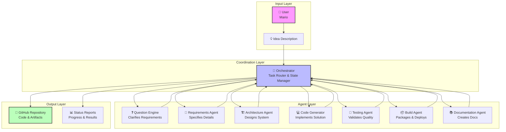
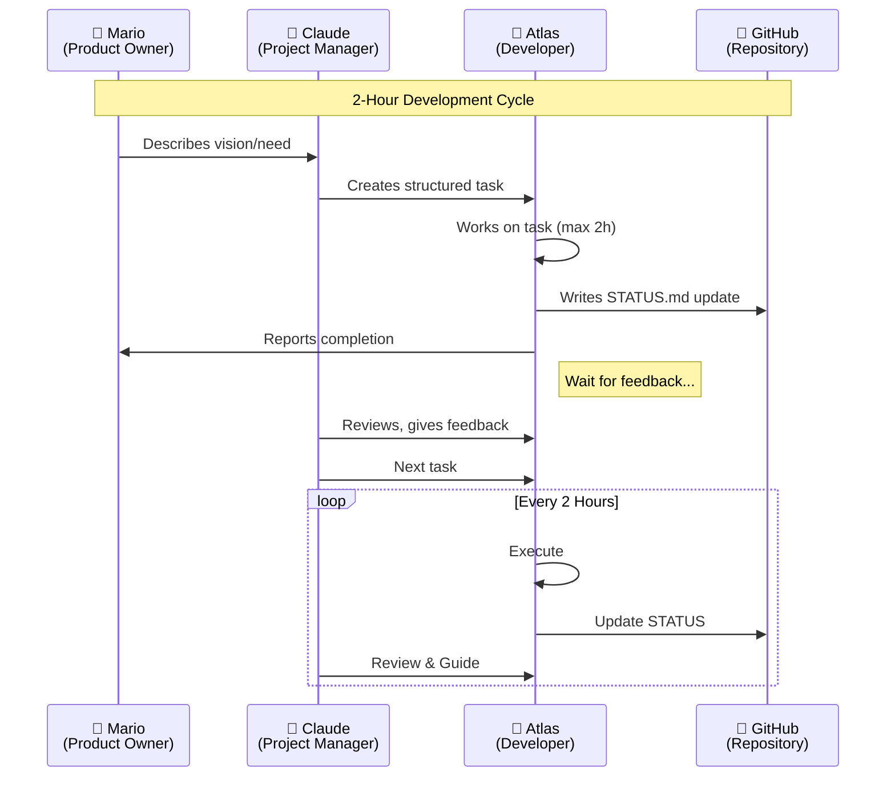

# 🏗️ Atlas System Architecture

> *A modular, multi-agent system for autonomous software development*

---

## 📊 High-Level Overview

Atlas consists of **specialized AI agents** coordinated by a central **Orchestrator**. Each agent handles a specific phase of the development lifecycle, communicating through a structured message bus.



---

## 🔄 Communication Flow



---

## 🧩 Component Descriptions

### 🎯 Orchestrator
**Purpose:** Central command & control  
**Responsibilities:**
- Route tasks to appropriate agents
- Maintain project state and context
- Handle agent failures and retries
- Aggregate outputs into cohesive results
- Manage the 2-hour work cycle

### ❓ Question Engine
**Purpose:** Requirements clarification  
**Responsibilities:**
- Identify ambiguities in user requests
- Generate clarifying questions
- Build comprehensive requirement specifications
- Validate completeness before proceeding

### 📝 Requirements Agent
**Purpose:** Specification formalization  
**Responsibilities:**
- Convert natural language to structured requirements
- Define acceptance criteria
- Identify edge cases and constraints
- Create technical specifications

### 🏗️ Architecture Agent
**Purpose:** System design  
**Responsibilities:**
- Design component structure
- Select appropriate patterns and technologies
- Define interfaces and data flows
- Create architecture diagrams

### 💻 Code Generator
**Purpose:** Implementation  
**Responsibilities:**
- Generate production-ready code
- Follow best practices and style guides
- Handle error cases and logging
- Produce well-documented code

### 🧪 Testing Agent
**Purpose:** Quality assurance  
**Responsibilities:**
- Write unit and integration tests
- Execute test suites
- Generate coverage reports
- Identify bugs and edge cases

### 📦 Build Agent
**Purpose:** Deployment preparation  
**Responsibilities:**
- Create Docker containers
- Set up CI/CD pipelines
- Package artifacts
- Prepare deployment configurations

### 📚 Documentation Agent
**Purpose:** Knowledge capture  
**Responsibilities:**
- Generate API documentation
- Create user guides
- Write architecture overviews
- Maintain changelogs

---

## 📡 Data Flow

```
┌─────────────────────────────────────────────────────────────┐
│                     INPUT                                   │
│  Natural language description of desired software           │
└────────────────────┬────────────────────────────────────────┘
                     │
                     ▼
┌─────────────────────────────────────────────────────────────┐
│              QUESTION ENGINE                                │
│  • Identify missing information                             │
│  • Generate clarification questions                         │
│  • Loop until requirements are clear                        │
└────────────────────┬────────────────────────────────────────┘
                     │
                     ▼
┌─────────────────────────────────────────────────────────────┐
│              REQUIREMENTS AGENT                             │
│  • Formalize specifications                                 │
│  • Define acceptance criteria                               │
│  • Document constraints                                     │
└────────────────────┬────────────────────────────────────────┘
                     │
                     ▼
┌─────────────────────────────────────────────────────────────┐
│              ARCHITECTURE AGENT                             │
│  • Design system structure                                  │
│  • Choose tech stack                                        │
│  • Define interfaces                                        │
└────────────────────┬────────────────────────────────────────┘
                     │
                     ▼
┌─────────────────────────────────────────────────────────────┐
│              CODE GENERATOR                                 │
│  • Implement components                                     │
│  • Follow style guidelines                                  │
│  • Add error handling                                       │
└────────────────────┬────────────────────────────────────────┘
                     │
                     ▼
┌─────────────────────────────────────────────────────────────┐
│              TESTING AGENT                                  │
│  • Write tests                                              │
│  • Execute test suite                                       │
│  • Report coverage                                          │
└────────────────────┬────────────────────────────────────────┘
                     │
                     ▼
┌─────────────────────────────────────────────────────────────┐
│              BUILD AGENT                                    │
│  • Create containers                                        │
│  • Set up CI/CD                                             │
│  • Package for deployment                                   │
└────────────────────┬────────────────────────────────────────┘
                     │
                     ▼
┌─────────────────────────────────────────────────────────────┐
│                     OUTPUT                                  │
│  • Source code repository                                   │
│  • Documentation                                            │
│  • Deployment artifacts                                     │
│  • Status reports                                           │
└─────────────────────────────────────────────────────────────┘
```

---

## 🛠️ Technology Decisions

### Why Python?
- **Rich ecosystem** — Extensive libraries for AI/ML integration
- **Readability** — Clean syntax for generated code
- **Testing framework** — Excellent pytest support
- **Industry standard** — Widely used in AI/ML applications

### Why Multi-Agent Architecture?
- **Separation of concerns** — Each agent specializes
- **Scalability** — Easy to add new capabilities
- **Resilience** — One agent failing doesn't break the system
- **Modularity** — Agents can be improved independently

### Why LLM-Based?
- **Natural language understanding** — Parse ambiguous requirements
- **Code generation** — Produce human-readable implementations
- **Context awareness** — Maintain understanding across long tasks
- **Adaptability** — Handle diverse project types

---

## 🔒 Security & Safety

- **Sandboxed execution** — Generated code runs in isolated environments
- **Human-in-the-loop** — Critical decisions require approval
- **Audit trail** — All actions logged in GitHub commits
- **Rate limiting** — Prevent runaway automation

---

## 🚀 Future Enhancements

- [ ] **Self-improvement loop** — Atlas learns from past projects
- [ ] **Multi-language support** — Generate code in Go, Rust, TypeScript
- [ ] **Visual IDE integration** — Web-based project dashboard
- [ ] **Auto-scaling** — Spawn multiple agents for parallel work
- [ ] **Knowledge base** — Long-term memory of patterns and solutions

---

*"Architecture is the decisions you wish you could get right early."* 🏗️
